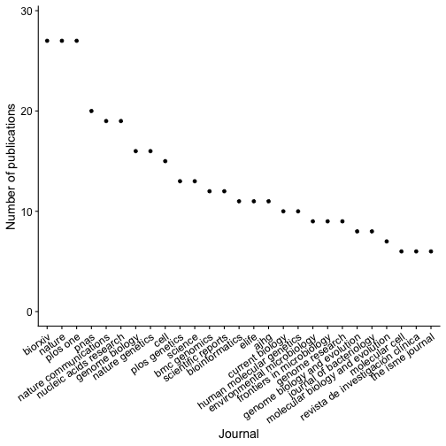
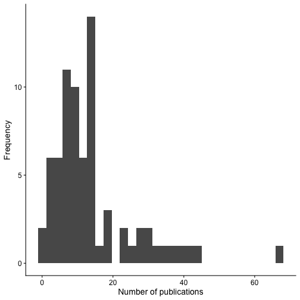
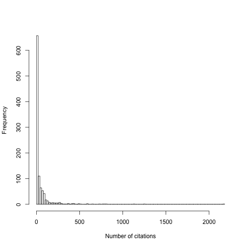
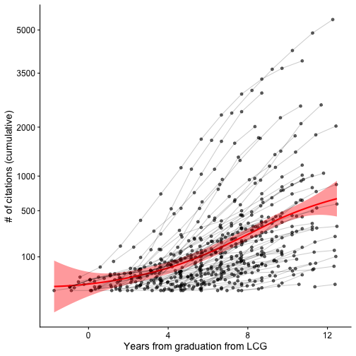

UNAM's [Undergrad program in Genomic Sciences](https://www.lcg.unam.mx/) (LCG, for its initials in Spanish) was created with the objective of providing students with the necessary background to develop genomics research. The program has a very strict selection criteria, involving two exams and one interview. Classes are small (20 to 30 people) compared to other UNAM programs. The first students graduated in August of 2009. I know that most *alumni* continue their education and further obtain masters and PhD degrees. Some of them enter prestigious PhD programs both in Mexico and abroad.  Perhaps the most accomplished *alumni*, academically speaking, are around 5 to 10 graduates that now lead independent research groups. I think most these research groups are based at [UNAM Juriquilla](http://www.campusjuriquilla.unam.mx/), Mexico. Others have accomplish a lot in their careers outside of academia. For example, [Mariana Matus](https://www.biobot.io/about_us.php) is the CEO and co-founder of a start-up company in Boston.

In any case, the objective of this document is to assess the impact that LCG has had in academic research, calculating the number of publications from LCG *alumni* as well as the impact of these publications.

# The data

## List of LCG *alumni*

In order to obtain the number of publication and citation statistics for each LCG alumni, I generated a Google spreadsheet that contains each student graduated by August 23th of 2019. The list of graduates, along with the date of graduation, was obtained from the [LCG's website](https://www.lcg.unam.mx/titulados/). I manually filled the columns of the spreadsheet with Google Scholar identifiers and I tried to fill the class to which they belong when I could remember. I collected data for the first 6th classes that graduated from LCG. Then I got bored/tired and stopped. If anyone is interested in helping filling the spreadsheet further, please let me know. For now, the code below reads this compiled spreadsheet into `R`.


```r
library(googlesheets)
gap <- gs_title( "GoogleGenomicos" ) ## you need to have this spreadsheet in your google drive and be logged in
dat <- gs_read( gap )
head( dat )
```

```
## # A tibble: 6 x 4
##   Name                              Graduation Generation GoogleScholarID
##   <chr>                             <date>          <dbl> <chr>          
## 1 Rocío Domínguez Vidaña            2007-09-14         NA C87y0MMAAAAJ   
## 2 Lucía Guadalupe Morales Reyes     2007-09-14         NA k6GlzNUAAAAJ   
## 3 Selene Lizbeth Fernández Valverde 2007-09-24         NA iHnkhAgAAAAJ   
## 4 Alejandra Eugenia Medina Rivera   2007-10-01         NA 7cF2WKQAAAAJ   
## 5 Estefanía García Ruiz             2007-10-04         NA <NA>           
## 6 Santiago Sandoval Motta           2007-10-04         NA 1Ud8j-UAAAAJ
```


Out of the data I compiled, I could find 73 profiles, which correspond to 
26.74\% of current graduates. These data corresponds to roughly 47.71 \% of the students from the first six classes. **Missing profiles are most probably not at random**, as people with more publications are more likely to have a Google Scholar profile. **This could result in inflated estimates and it is something to consider when reaching conclusions**.

## Publication numbers and citations

Having collected the Google scholar identifiers for LCG alumni, I am using the *R CRAN* package called [scholar](https://cran.r-project.org/web/packages/scholar/index.html) to scramble the data for each Google scholar profile. For each profile, I am obtaining the citation history, and the data of each of the publications. In each iteration, I am introducing `Sys.sleep` commands randomizing the number of seconds following normal distributions to sample waiting times between each query in order to avoid [*captchas*](https://es.wikipedia.org/wiki/Captcha).


```r
library(scholar)

googleIDs <- dat$GoogleScholarID
googleIDs <- googleIDs[!is.na( googleIDs )]

scholarDataFile <- "scholarData.rds"
if( !file.exists(scholarDataFile) ){
  scholarData <- lapply( googleIDs, function(x){
    pubs <- try( get_publications(x) )
    Sys.sleep( abs( rnorm(1, 10, 5) ) )## randomize waiting times to avoid captcha's
    cits <- try( get_citation_history(x) )
    Sys.sleep( abs( rnorm(1, 60, 20) ) )
    list( pubRecord=pubs,
          citHistory=cits )
  } )
  names( scholarData ) <- googleIDs
  saveRDS( scholarData, file=scholarDataFile )
}
scholarData <- readRDS(scholarDataFile)
```

Then, I do some data wrangling to convert them to long-formatted data frames and start exploring these data. 


```r
pubRecords <- lapply( scholarData, "[[", "pubRecord" )
citHistory <- lapply( scholarData, "[[", "citHistory" )

stopifnot(all(vapply(pubRecords, class, character(1)) == "data.frame"))
stopifnot(all(vapply(citHistory, class, character(1)) == "data.frame"))


pubRecords <- purrr::map_df( pubRecords, ~as.data.frame(.x), .id="GoogleScholarID")
citHistory <- purrr::map_df( citHistory, ~as.data.frame(.x), .id="GoogleScholarID")
```

# Publication records

## Where do LCG *alumni* publish? 

Where do LCG *alumni* publish? The code below computes the number of articles published in each journal. Then, it sorts the journals depending on the number of publications co-authored by LCG alumni. Below I am plotting the journals that appear most frequently among the publication profiles of LCG alumni. 


```r
library(magrittr)
library(ggplot2)
library(cowplot)

pubRecords <- pubRecords %>%
  dplyr::filter(journal != "")

theme_set(theme_cowplot())
pubPerJournal <- pubRecords %>%
  dplyr::select( journal, cid ) %>%
  unique() %>%
  dplyr::group_by( journal=tolower(journal) ) %>%
  dplyr::summarise( numb=dplyr::n() ) %>%
  dplyr::arrange( desc(numb) ) %>%
  dplyr::filter( numb > 5, journal != "" )

pubPerJournal$journal <- forcats::fct_reorder(pubPerJournal$journal, pubPerJournal$numb, .desc=TRUE)

levels(pubPerJournal$journal) <-
  gsub("proceedings of the national academy of sciences", "pnas", levels( pubPerJournal$journal) )
levels(pubPerJournal$journal) <-
  gsub("the american journal of human genetics", "ajhg", levels( pubPerJournal$journal) )

pubPerJournal %>%
  ggplot( aes( journal, numb ) ) +
  geom_point() +
  theme(axis.text.x=element_text(angle=35, hjust=1)) +
  labs(y="Number of publications", x="Journal") +
  ylim(0, 29)
```



It is interesting that LCG *alumni* appear in 27 biorXiv preprints, the same number of Nature and PLOS ONE papers. As a second group of journals, we have PNAS, Nucleic Acids Research and Nat Communications with an average of 19 papers.  Not surprisingly, the most frequent journals publish a lot of research in genomics. 

## Number of publications of LCG *alumni*

Now it is a good time to remember that our sample of profiles might be biased towards inflated publication numbers. Nevertheless, the histogram below shows the distribution on the number of publications per *alumnus*:


```r
pubRecords <- dplyr::left_join( pubRecords, dat )

pubRecords %>%
  dplyr::group_by( GoogleScholarID ) %>%
  dplyr::summarize( number=dplyr::n(), graduation=unique(Graduation) ) %>%
  ggplot(aes(number)) +
  geom_histogram( bins=30 ) +
  labs(x="Number of publications", y="Frequency")
```



The distribution above has a long tail. Obviously, the more time a person stays in research, the more publications that person will have. Thus, a more informative plot is one that also considers the date of graduation. To do so, I plotted the number of publications as a function of the years since graduation. 


```r
pubRecords %>%
  dplyr::group_by( GoogleScholarID ) %>%
  dplyr::summarize( number=dplyr::n(), graduation=unique(Graduation) ) %>%
  dplyr::mutate( timeFromGrad=(Sys.Date()- graduation) ) %>%
  ggplot( aes( timeFromGrad/30/12, number ) ) +
  geom_point(alpha=0.5) +
  labs(x="Time since graduation (years)", y="Number of publications")
```


There seems to be quite some variability. There are people that have many papers! The variability in the plot above could reflect differences in the collaborative environment between fields or institutions. For example, people working in more collaborative fields such as consortia will have more papers. Who are the *alumni* with the highest number of publications? Below is top 10 ranking, which indicates us that the clear outlier from the plots above corresponds to [Claudia Gonzaga-Jauregui](https://scholar.google.com/citations?user=YMcmOsAAAAAJ&hl) from the first LCG class, who has co-authored 68 papers.


```r
pubRecords %>%
  dplyr::group_by( GoogleScholarID ) %>%
  dplyr::summarize( number=dplyr::n(), graduation=unique(Graduation), name=unique(Name) ) %>%
  dplyr::arrange( desc(number) ) %>%
  head(10)
```

```
## # A tibble: 10 x 4
##    GoogleScholarID number graduation name                             
##    <chr>            <int> <date>     <chr>                            
##  1 YMcmOsAAAAAJ        68 2007-11-28 Claudia Gabriela Gonzaga Jáuregui
##  2 nQuXihQAAAAJ        43 2009-07-02 María del Carmen Avila Arcos     
##  3 Mbic02QAAAAJ        41 2011-08-01 Gabriel Cuellar Partida          
##  4 Zkyg60AAAAAJ        39 2007-10-17 Gabriela Angélica Martínez Nava  
##  5 h57-MykAAAAJ        37 2009-06-03 Leonardo Collado Torres          
##  6 WIgmpAMAAAAJ        34 2008-06-25 Miguel Enrique Rentería Rodríguez
##  7 aXchdQQAAAAJ        32 2009-06-03 María Gutiérrez Arcelus          
##  8 7cF2WKQAAAAJ        30 2007-10-01 Alejandra Eugenia Medina Rivera  
##  9 sqH-GCQAAAAJ        29 2009-01-09 Angélica Paola Hernández Pérez   
## 10 3khb6PYAAAAJ        28 2011-10-06 José Víctor Moreno Mayar
```

## Fifth generation compared to others

I have the feeling that my class, also known as [*La Quinta*](https://www.youtube.com/watch?v=kBpc3WZOubQ), has done better in publishing compared to other classes. In order to test this hypothesis, I filtered the data for only those *alumni* that graduated before the first *alumni* from the 5th class. To account for the time each person has spent in research, I compared the number of publications after 7 years of graduation. If we subject my feeling to hypothesis testing, we see that there is not a significant difference in the number of publications between *alumni* from *La Quinta* and other classes. My feeling seems to be only that: a feeling.


```r
pubRecords$year <- as.Date(paste0( pubRecords$year, "-01-01"))

firstQuinto <- max(dat$Graduation[which(dat$Generation == 5)])

pubRecords %>%
  dplyr::filter( Graduation - firstQuinto < 0 | Generation == 5, year - Graduation < 365*7) %>%
  dplyr::mutate( Generation=ifelse(Generation != 5 | is.na(Generation), "1st-4th", "5th") ) %>%
  dplyr::group_by( GoogleScholarID ) %>%
  dplyr::summarize( numbs=dplyr::n(), Generation=unique(Generation) ) %>%
  wilcox.test( numbs ~ Generation, data=. )
```

```
## 
## 	Wilcoxon rank sum test with continuity correction
## 
## data:  numbs by Generation
## W = 365.5, p-value = 0.5042
## alternative hypothesis: true location shift is not equal to 0
```

# Impact of research as measured by citation numbers

One way the impact of a publication is assessed is by the number citations in literature. Nevertheless, people have argued that the most impactful research is not reflected in the number of citations [^1] and the citation rates vary from field to field. For example, papers in human genomics are cited more frequently than plant genomics papers. Anyway, if we explore the distribution of citations per paper, we observed the typical distribution of citations counts, which has been the subject of some statistics papers[^2].

[^1]: https://www.nature.com/news/citation-is-not-the-only-impact-1.22917
[^2]: See for example: https://arxiv.org/pdf/0810.1426.pdf


```r
citHistory <- dplyr::left_join( citHistory, dat )
citHistory$year <- as.Date(paste0( citHistory$year, "-12-31"))
hist( pubRecords$cites, 100, xlab="Number of citations", main="" )
```



Below, I show the most cited papers co-authored by LCG *alumni*. The two first papers are consortium papers, one from the [International HapMap 3 Consortium](https://www.sanger.ac.uk/resources/downloads/human/hapmap3.html) and a review paper giving an overview of the [Bioconductor](https://www.bioconductor.org/) project. There is also a Science paper coauthored by two LCG alumni, [María Avila](http://liigh.unam.mx/profile/dra-maria-c-avila-arcos/) and [Victor Moreno-Mayar](https://scholar.google.com/citations?user=3khb6PYAAAAJ&hl), who have become leaders in the field of ancient DNA. 


```r
pubRecords %>%
  dplyr::arrange( desc(cites) ) %>%
  dplyr::select( title, journal, Name, cites ) %>%
  as.data.frame() %>%
  head(10)
```

```
##                                                                                                    title
## 1                             Integrating common and rare genetic variation in diverse human populations
## 2                                       Orchestrating high-throughput genomic analysis with Bioconductor
## 3                                                 Defining the core Arabidopsis thaliana root microbiome
## 4                    Transcriptome genetics using second generation sequencing in a Caucasian population
## 5                                                Detecting differential usage of exons from RNA-seq data
## 6                               Whole-genome sequencing in a patient with Charcot–Marie–Tooth neuropathy
## 7                    Common regulatory variation impacts gene expression in a cell type–dependent manner
## 8  Genome-wide recessive genetic screening in mammalian cells with a lentiviral CRISPR-guide RNA library
## 9                            An Aboriginal Australian genome reveals separate human dispersals into Asia
## 10                           An Aboriginal Australian genome reveals separate human dispersals into Asia
##                            journal                                Name
## 1                           Nature   Claudia Gabriela Gonzaga Jáuregui
## 2                   Nature methods              Alejandro Reyes Quiroz
## 3                           Nature                 Sur Herrera Paredes
## 4                           Nature             María Gutiérrez Arcelus
## 5                  Genome Research              Alejandro Reyes Quiroz
## 6  New England Journal of Medicine   Claudia Gabriela Gonzaga Jáuregui
## 7                          Science             María Gutiérrez Arcelus
## 8             Nature biotechnology Martín Del Castillo Velasco Herrera
## 9                          Science        María del Carmen Avila Arcos
## 10                         Science            José Víctor Moreno Mayar
##    cites
## 1   2171
## 2   1259
## 3   1124
## 4    816
## 5    800
## 6    767
## 7    731
## 8    645
## 9    587
## 10   587
```

If we aggregate the number of citations per alumni, the 10 most cited *alumni* are listed below.


```r
pubPerPerson <- pubRecords %>%
  dplyr::group_by( GoogleScholarID ) %>%
  dplyr::summarize( numPublications=dplyr::n() )
citRates <- citHistory %>%
  dplyr::group_by( GoogleScholarID, Name ) %>%
  dplyr::summarize( numCitations=sum( cites ) )
citRates %>%
  dplyr::arrange( desc(numCitations) ) %>%
  head(10)
```

```
## # A tibble: 10 x 3
## # Groups:   GoogleScholarID [10]
##    GoogleScholarID Name                              numCitations
##    <chr>           <chr>                                    <dbl>
##  1 YMcmOsAAAAAJ    Claudia Gabriela Gonzaga Jáuregui         5402
##  2 aXchdQQAAAAJ    María Gutiérrez Arcelus                   3899
##  3 8QLuIWgAAAAJ    Alejandro Reyes Quiroz                    2899
##  4 WIgmpAMAAAAJ    Miguel Enrique Rentería Rodríguez         2567
##  5 nQuXihQAAAAJ    María del Carmen Avila Arcos              2535
##  6 7cF2WKQAAAAJ    Alejandra Eugenia Medina Rivera           2025
##  7 3khb6PYAAAAJ    José Víctor Moreno Mayar                  2013
##  8 szU4z5UAAAAJ    Sur Herrera Paredes                       1797
##  9 Mbic02QAAAAJ    Gabriel Cuellar Partida                   1753
## 10 _S26cFEAAAAJ    Fernando Alberto Rabanal Mora             1194
```

Another way of doing this ranking is to consider the average number citations per publication for each *alumnus* (i.e. dividing the number of citations over the number of publications). This operation is done by the code below. It turns out that I rank in the first place, this is because I co-authored the Bioconductor review mentioned above and [a paper](https://bioconductor.org/packages/release/bioc/html/DEXSeq.html) describing a statistical method that has been broadly used by the RNA-seq community. This ranking also brings [Jaime A Castro-Mondragon](http://folk.uio.no/jamondra/) to the top 10. Although he might have less papers than others in top raking positions (because he is much younger than the rest!), his work has been highly cited. 


```r
dplyr::left_join( citRates, pubPerPerson ) %>%
  dplyr::mutate( rateCitations = numCitations/numPublications ) %>%
  dplyr::arrange( desc(rateCitations) ) %>%
  dplyr::filter( numPublications > 3 ) %>%
  dplyr::ungroup() %>%
  dplyr::select(Name, numPublications, numCitations, rateCitations) %>%
  head(10)
```

```
## # A tibble: 10 x 4
##    Name                          numPublications numCitations rateCitations
##    <chr>                                   <int>        <dbl>         <dbl>
##  1 Alejandro Reyes Quiroz                     15         2899         193. 
##  2 María Gutiérrez Arcelus                    32         3899         122. 
##  3 Jaime Abraham Castro Mondrag…              11          944          85.8
##  4 Fernando Alberto Rabanal Mora              15         1194          79.6
##  5 Mario Sandoval Calderón                     8          636          79.5
##  6 Claudia Gabriela Gonzaga Jáu…              68         5402          79.4
##  7 Jorge Omar Yáñez Cuna                      13         1009          77.6
##  8 Miguel Enrique Rentería Rodr…              34         2567          75.5
##  9 José Víctor Moreno Mayar                   28         2013          71.9
## 10 Sur Herrera Paredes                        25         1797          71.9
```

Finally, I am plotting the cumulative number of citations per *alumni* as a function of the time since graduation from the LCG. Each line is one *alumnus* and the red line is a [loess regression curve](https://en.wikipedia.org/wiki/Local_regression). As expected, the number of citations increases with time. 


```r
pr <- citHistory %>%
  dplyr::mutate( timeFromGrad=as.numeric(year-Graduation) ) %>%
  dplyr::group_by( GoogleScholarID ) %>%
  dplyr::mutate( cumCites=cumsum(cites) )

loessFit <- loess(cumCites~timeFromGrad, data=pr)

citHistory %>%
  dplyr::mutate( timeFromGrad=as.numeric(year-Graduation) ) %>%
  dplyr::group_by( GoogleScholarID ) %>%
  dplyr::mutate( cumCites=cumsum(cites) ) %>%
  ggplot( aes( timeFromGrad/30/12, cumCites ) ) +
  geom_point(alpha=0.6) + 
  geom_smooth(col="red", fill="red") +
  geom_line( aes(group=GoogleScholarID), alpha=0.2 ) +
  scale_y_sqrt( breaks=c(20, 100,  500, 1000, 2000, 3500, 5000), 
                minor_breaks=seq(100, 500, 100) ) +
  labs(y="# of citations (cumulative)", x="Years from graduation from LCG")
```



According to the loess regression, the average *alumni* has around 303 citations after 7 years of graduation. 

# Conclusions

**LCG's impact on academic research is demonstrated by 938 manuscripts co-authored by *alumni* from the first six graduated classes**. Most of these papers are published in biology journals. Altogether, these 938 papers have a total of 40995 citations and the median number of citations is 9. Note that the total number of papers and citations might be higher, since I only collected data from the first 6 classes and I was able to find Google scholar profiles for less than 50% of the *alumni* that I searched for.

At LCG, we were often told that we are better than other undergrad programs. As a scientist I like to support my statements with data: although the number of publications from LCG *alumni* might sound as excellent numbers, **this analysis does not show that LCG *alumni* are better researchers than *alumni* from than other undergrad programs**. In order to do this comparison, we would need to compare data from people graduated from other programs and normalize for differences between fields (for example, math papers are less cited than biology papers). 

However, it is evident is that **genomics research has been benefited from the creation of LCG and that the investment in more research-focused undergrad programs will benefit academic research**.

# Considerations and caveats of this analysis

* I am considering number of publications and citations to measure impact. This estimates **don't take into account other activities that are impactful, such as teaching, outreach and science communication**. 
* Talking about impactful researchers, I asked [Leo Collado-Torres](http://lcolladotor.github.io/) for feedback on this analysis. Among other great comments, he pointed out that Google Scholar also collects records that are not necessarily scientific publications. Google scholar records can include patents, conference abstracts, thesis, software manuals, etc. If a profile is not well curated, it could include duplicated entries (for example, two versions of the same manuscript, one posted in bioRxiv and the published version). This could affect the number of publications I describe throughout the analysis. He also suggested to analyze h-indexes and networks of both co-authors and citations: this will come in version 2 of this analysis.
* This analysis does not distinguish the degree of contributions to publications (e.g. first authorship, etc). It would be interesting to incorporate this information into the analysis. 
* As mentioned before, these numbers are taken from *alumni* that have Google scholar profiles. As people with more publications will tend to have Google scholar profiles, the averages presented in this analysis are likely to be overestimated.

# sessionInfo()


```r
sessionInfo()
```

```
## R version 3.6.0 (2019-04-26)
## Platform: x86_64-apple-darwin15.6.0 (64-bit)
## Running under: macOS Mojave 10.14
## 
## Matrix products: default
## BLAS:   /Library/Frameworks/R.framework/Versions/3.6/Resources/lib/libRblas.0.dylib
## LAPACK: /Library/Frameworks/R.framework/Versions/3.6/Resources/lib/libRlapack.dylib
## 
## locale:
## [1] en_US.UTF-8/en_US.UTF-8/en_US.UTF-8/C/en_US.UTF-8/en_US.UTF-8
## 
## attached base packages:
## [1] stats     graphics  grDevices utils     datasets  methods   base     
## 
## other attached packages:
## [1] cowplot_1.0.0      ggplot2_3.2.1      magrittr_1.5      
## [4] scholar_0.1.7      googlesheets_0.3.0 knitr_1.24        
## 
## loaded via a namespace (and not attached):
##  [1] Rcpp_1.0.2        highr_0.8         cellranger_1.1.0 
##  [4] pillar_1.4.2      compiler_3.6.0    forcats_0.4.0    
##  [7] R.methodsS3_1.7.1 R.utils_2.9.0     tools_3.6.0      
## [10] zeallot_0.1.0     digest_0.6.20     gtable_0.3.0     
## [13] jsonlite_1.6      evaluate_0.14     tibble_2.1.3     
## [16] R.cache_0.13.0    pkgconfig_2.0.2   rlang_0.4.0      
## [19] cli_1.1.0         curl_4.0          xfun_0.9         
## [22] withr_2.1.2       dplyr_0.8.3       httr_1.4.1       
## [25] stringr_1.4.0     xml2_1.2.2        vctrs_0.2.0      
## [28] askpass_1.1       hms_0.5.1         grid_3.6.0       
## [31] tidyselect_0.2.5  glue_1.3.1        R6_2.4.0         
## [34] fansi_0.4.0       readr_1.3.1       purrr_0.3.2      
## [37] ellipsis_0.2.0.1  scales_1.0.0      backports_1.1.4  
## [40] assertthat_0.2.1  rvest_0.3.4       colorspace_1.4-1 
## [43] labeling_0.3      utf8_1.1.4        stringi_1.4.3    
## [46] lazyeval_0.2.2    munsell_0.5.0     openssl_1.4.1    
## [49] crayon_1.3.4      R.oo_1.22.0
```

